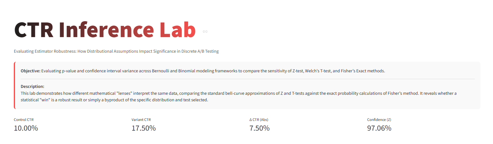
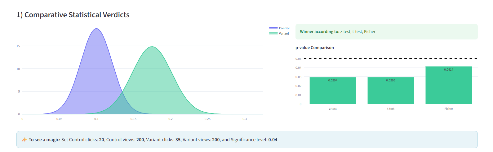
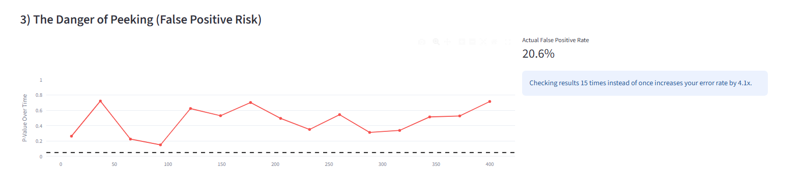

# 📊 CTR Inference Lab

A high-impact **Streamlit** laboratory designed for evaluating the robustness of A/B test results. This tool visualizes how different distributional assumptions and statistical lenses (Z-test, T-test, and Fisher’s Exact) impact conversion rate optimization (CRO) decisions.

---

## 🚀 Key Features

- **Multi-Estimator Engine**
  - Z-Test (normal approximation)
  - Welch’s T-Test
  - Fisher’s Exact Test

- **Advanced Confidence Intervals**
  - Wald Interval
  - Newcombe-Wilson Interval

- **Peeking Simulator**
  Demonstrates false positive inflation from repeated interim checks.

- **Interactive Visualizations**
  Built using Plotly for intuitive inference comparison.

---

## 🧪 The "Magic" Scenario

Try:

- **Control:** 20 / 200  
- **Variant:** 35 / 200  
- **α:** 0.04  

Z and T may show significance while Fisher does not.

This highlights approximation risk in moderate sample experiments.

---

## 🛠 Installation & Usage

1. **Install dependencies:**

Make sure Python 3.8+ is installed.

```bash
pip install streamlit pandas numpy matplotlib seaborn scipy.stats plotly.graph_objects math

```

2. **Download the app.py:**
   
3. **Run the app:**
   
   ```bash
   
   streamlit run Home.py 
   
   ```

4. **Open Streamlit.io:**
   
   ```bash
   Login using your GitHub
   Create an app
   Deploy
   ```
   
---

## Preview









